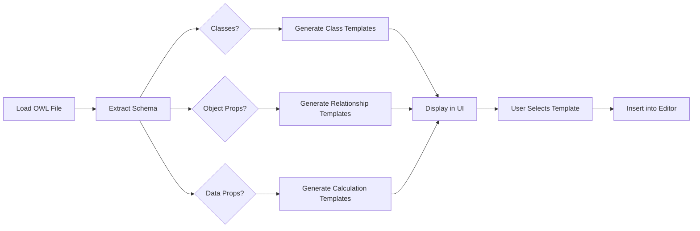

# SWRL Plugin: OWL-Based Templates

## Overview
The SWRL editor plugin now generates dynamic templates based on your actual OWL ontology file, providing context-specific rule templates that use your real classes, object properties, and data properties.

## Implementation Details

### 1. **Dynamic Template Generation**
Location: `plugins/swrl-editor-plugin/src/SWRLEditor.tsx` (lines 1380-1528)

The plugin fetches the ontology schema via `/api/ontology/{projectId}/schema` and generates templates for:

#### Class-Based Templates:
- **Classification Rules**: Classify entities based on data property values
  - Example: `Person(?x) ^ hasAge(?x, ?val) ^ swrlb:greaterThan(?val, 100) -> PersonClassified(?x)`
  
- **String Matching**: Classify based on string property content
  - Example: `Person(?x) ^ hasName(?x, ?str) ^ swrlb:contains(?str, "value") -> PersonMatched(?x)`
  
- **SQWRL Queries**: Query and aggregate class instances
  - Example: `Person(?x) ^ hasAge(?x, ?val) -> sqwrl:select(?x, ?val) ^ sqwrl:orderBy(?val)`

#### Object Property Templates:
- **Property Chains**: Infer relationships through property chains
  - Example: `hasParent(?x, ?y) ^ hasSibling(?y, ?z) -> hasParentSiblingChain(?x, ?z)`
  
- **Shared Value Relationships**: Find entities sharing property values
  - Example: `Person(?x) ^ Person(?y) ^ hasParent(?x, ?ref) ^ hasParent(?y, ?ref) ^ swrlb:notEqual(?x, ?y) -> relatedhasParent(?x, ?y)`

#### Data Property Templates:
- **Mathematical Operations**:
  - Sum: `Person(?x) ^ hasAge(?x, ?v1) ^ hasScore(?x, ?v2) ^ swrlb:add(?sum, ?v1, ?v2) -> hasAgeScoreSum(?x, ?sum)`
  - Product: `Person(?x) ^ hasAge(?x, ?v1) ^ hasScore(?x, ?v2) ^ swrlb:multiply(?product, ?v1, ?v2) -> hasAgeScoreProduct(?x, ?product)`
  - Comparison: `Person(?x) ^ hasAge(?x, ?v1) ^ hasScore(?x, ?v2) ^ swrlb:greaterThan(?v1, ?v2) -> hasAgeGreater(?x, true)`

#### SQWRL Aggregate Templates:
- **Count**: Count instances of a class
- **Min/Max**: Find minimum/maximum values
- **Average**: Calculate average of property values

### 2. **UI Enhancements**

#### Template Display Priority:
1. **Ontology-Based Templates** (Green highlight) - Shown first, generated from your OWL file
2. **General Templates** (Purple highlight) - Collapsible fallback templates

#### Quick Insert Panel:
- Displays ontology-based templates prominently with green styling
- Shows "From your OWL file" indicator
- General templates are collapsible to reduce clutter
- Falls back to general templates if no OWL classes/properties are available

#### Template Dropdown in Editor:
- Hover-activated dropdown in the rule editor
- Shows ontology-based templates first in green section
- General templates in separate purple section below
- Wider dropdown (380px) for better readability

### 3. **Template Limit**
To prevent UI overwhelming, the system generates up to **20 dynamic templates** from the most common patterns in your ontology.

## How It Works



## Usage

1. **Load Your Ontology**: When you open a project with an OWL file, the plugin automatically:
   - Fetches classes, object properties, and data properties
   - Generates relevant SWRL rule templates
   - Updates the template panel

2. **Access Templates**:
   - Click the **Templates** button in the Quick Insert panel
   - Hover over the **Templates** dropdown in the rule editor
   - Ontology-based templates appear at the top with green styling

3. **Insert a Template**:
   - Click any template to insert it into your rule editor
   - Customize variable names, values, and operators as needed
   - Validate and save your rule

## Example Generation

For an ontology with:
- Classes: `Person`, `Student`, `Employee`
- Object Properties: `hasParent`, `hasSibling`, `worksFor`
- Data Properties: `hasAge`, `hasName`, `hasSalary`

Generated templates include:
```
✓ Person Classification (hasAge > 100)
✓ Student String Match (hasName contains "value")
✓ Query All Employee (ordered by hasSalary)
✓ hasParent → hasSibling Chain
✓ Person Shared hasParent
✓ Employee Sum hasAge+hasSalary
✓ Count Person
✓ Employee Min hasSalary
```

## Benefits

1. **Context-Aware**: Templates use your actual ontology entities
2. **Time-Saving**: No need to remember exact class/property names
3. **Learning Tool**: Shows SWRL syntax patterns for your domain
4. **Reduced Errors**: Pre-validated structure with correct entity names
5. **Scalable**: Automatically updates when ontology changes

## Files Modified

- `plugins/swrl-editor-plugin/src/SWRLEditor.tsx`
  - Enhanced `loadOntologySchema()` function (lines 1380-1528)
  - Updated `QuickInsertPanel` component (lines 348-470)
  - Updated template dropdown in editor (lines 2076-2110)

## Build

```bash
cd plugins/swrl-editor-plugin
npm run build
```

Output: `dist/index.js` (76.9 KiB)

## Future Enhancements

- [ ] Generate templates based on existing individuals in the ontology
- [ ] Smart template suggestions based on rule context
- [ ] Template search/filtering
- [ ] User-defined custom template library
- [ ] Template import/export
- [ ] ML-based template recommendation
